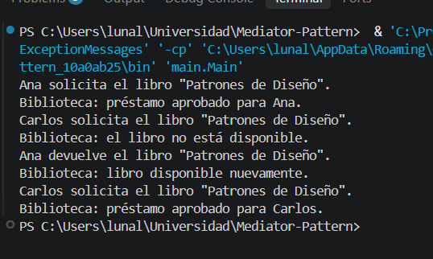

# Library Mediator System
> Introduction to Mediator Pattern

## Description
The context of this project is a university library where students used to contact the librarian and each other directly to check book availability, request loans, and return books. This created messy, tangled dependencies between every student and every other student.
The main goal is to introduce a `BibliotecaMediator` that centralizes all communication: students never talk to each other directly, they only talk to the mediator. The mediator is the only object that knows how to check a book's availability, approve or reject a loan, and update availability on return.
Two colleague students (Ana and Carlos) and a single shared book ("Patrones de Diseño") are used to demonstrate loan requests, a rejected request, a return, and a subsequent approved request, all routed through the mediator.
> Note: A full explanation of how the Mediator pattern reduces coupling between colleagues is embedded as Javadoc comments in the `Mediator` and `BibliotecaMediator` classes.

# Project Structure
Package: mediator

* interface Mediator (Mediator contract)
* class BibliotecaMediator (Concrete Mediator)

Package: colleague

* class Estudiante (Colleague)

Package: model

* class Libro (shared object coordinated by the mediator)

Package: main

* class Main (Client)

# How to Run

1. Clone or download the repository.
2. Open the project in a Java-compatible IDE such as VS Code, IntelliJ IDEA, or Eclipse.
3. Make sure Java is correctly installed and configured.
4. Compile the sources, e.g. `javac -d bin src/model/*.java src/mediator/*.java src/colleague/*.java src/main/*.java`.
5. Run `main.Main` to see the mediator coordinating requests and returns between Ana and Carlos.
6. Check the console output to verify that every request or return is announced by "Biblioteca:", never directly between students.

# Console Output

Last Modification: 25/09/2026